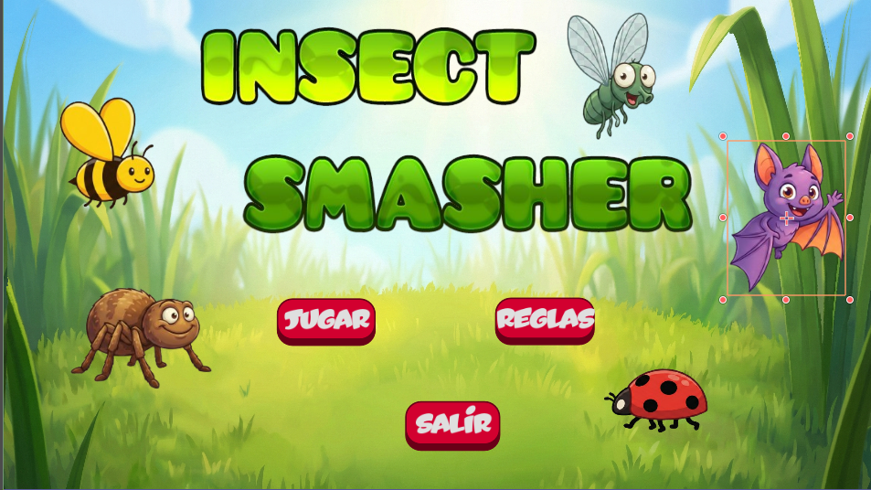
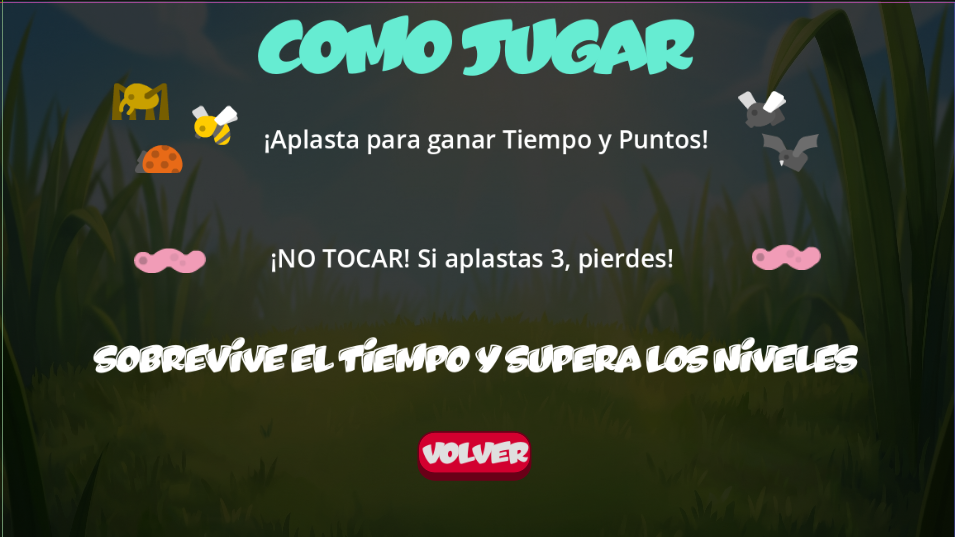
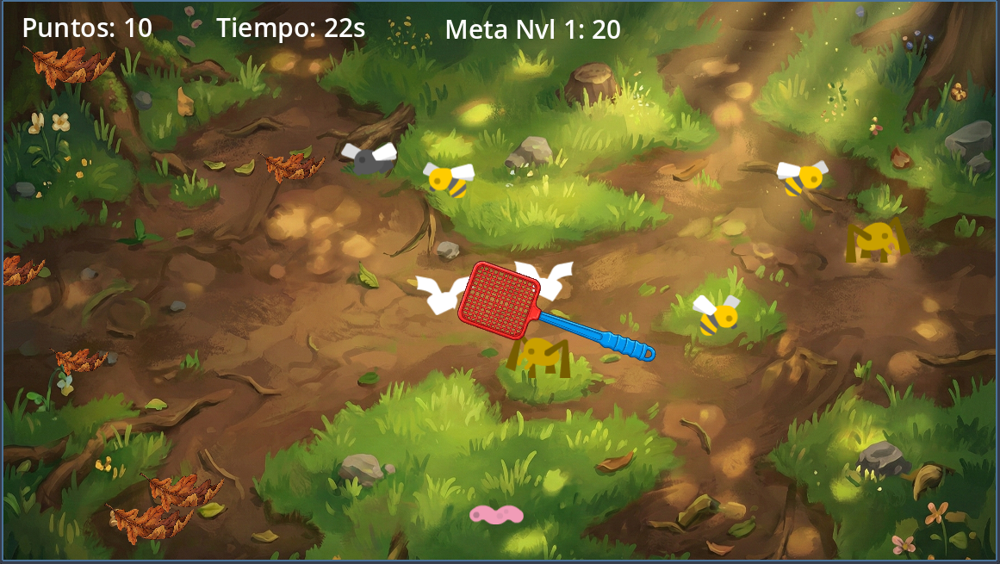
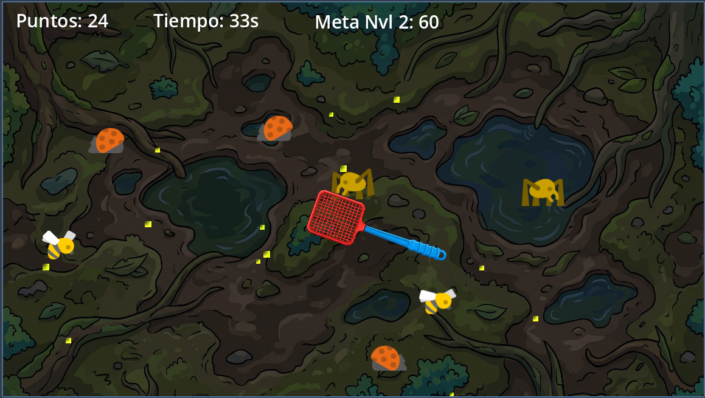
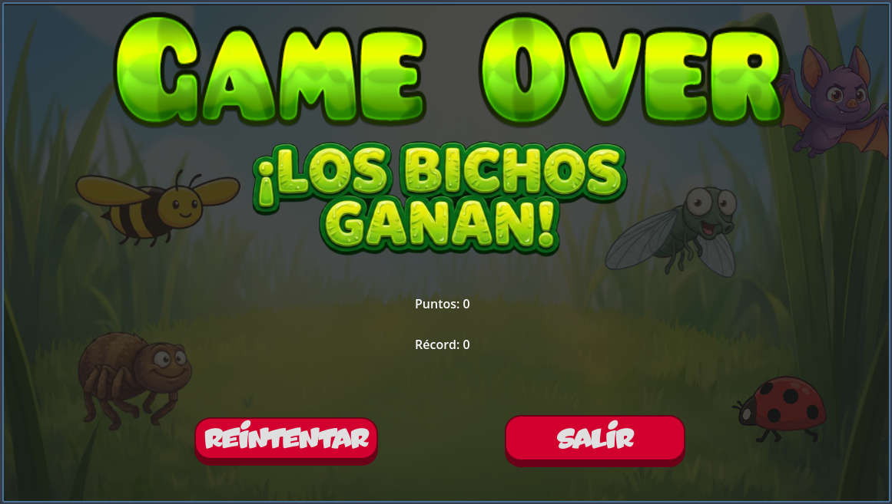

# 🪰 Insect Smasher

> Videojuego arcade 2D desarrollado en **Godot** como proyecto académico.

---

## 🎮 Descripción

**Insect Smasher** es un juego arcade en 2D en el que el jugador debe aplastar insectos para conseguir puntos antes de que se acabe el tiempo.

El juego incluye varios niveles, diferentes fondos, progresión de dificultad, sistema de puntuación y condiciones de derrota que obligan al jugador a prestar atención a los enemigos correctos.

---

## ✨ Características

- Menú principal con opciones de jugar, ver reglas y salir
- Pantalla de reglas
- Sistema de puntuación y tiempo
- Progresión por niveles
- Fondos diferentes según el nivel
- Enemigos con distintas velocidades y puntuaciones
- Condición especial de derrota al golpear varias veces al gusano rosa
- Efectos visuales, audio y elementos de interfaz

---

## 🛠️ Tecnologías utilizadas

- **Godot**
- **GDScript**
- Diseño de escenas 2D
- HUD y control de niveles
- Animaciones y partículas
- Audio y efectos visuales

---

## 👥 Trabajo en equipo

Este proyecto fue realizado en equipo junto con:

- Marcos Aranda
- Antonio Muñoz
- Ignacio Villacis

### Mi contribución
- **Ignacio Villacis**: desarrollo principal del videojuego, lógica general, animaciones, matamoscas, niveles, progresión de dificultad, sistema de puntuación y mayor parte de la implementación.
- **Marcos Aranda**: apoyo en recursos del juego, primer escenario, movimiento inicial de bichos y parte del sistema de tiempo.
- **Antonio Muñoz**: incorporación de música y apoyo en el proyecto.

---

## 🖼️ Capturas

### Menú principal

### Pantalla de reglas

### Gameplay

### Otro nivel

### Pantalla Game Over

---

## 📚 Documentación

El repositorio incluye documentación explicativa con descripción del juego, niveles, lógica, sistema de puntos y estructura de escenas.

- 📄 Ver documentación en `docs/documentacion-proyecto.pdf`

---

## 🎨 Recursos y créditos

Parte de los recursos gráficos utilizados para los insectos proceden de **Kenney Assets**.

---

## 📌 Estado del proyecto

Proyecto finalizado con fines académicos.

---
